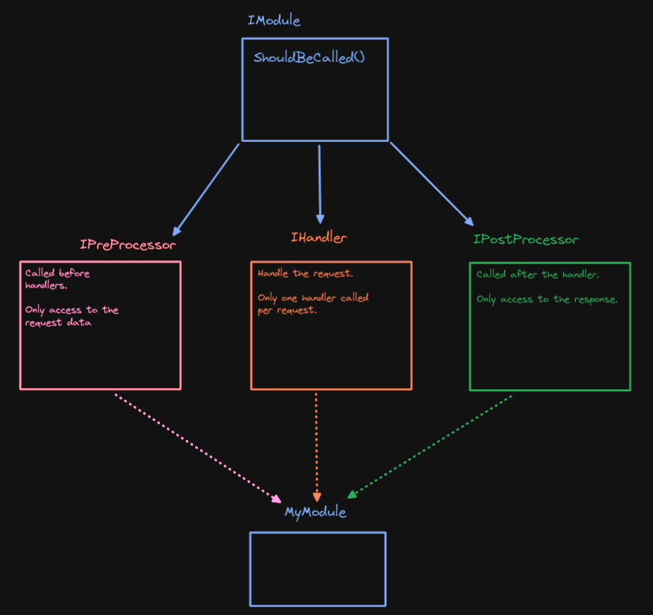

# Introduction

Ziapi is an API based on the [OSI model](https://en.wikipedia.org/wiki/OSI_model) and links itself to the last 4 layers.

## Functionnality

The 4 layers which we link the API to are (in order) : 
- `Transport` : Tells how data is transfered, for instance UDP or TCP protocol.
- `Session` : Manages connections, for example how long the server should keep a connection alive.
- `Presentation` : Ensures data usability and translate (encrypts/decrypts) data if needed.
- `Application` : Where basic modules go. Human-computer operations happen here.

In our implementation, the `Presentation` layer is contained inside the `Application` one. We consider that data usability check modules and security ones belongs in the Application layer.

With this implementation, you are able to plug any module at any step of the network processing.

## Core achitecture

Here is how the connection with someone is handled.

- Network corresponds to your network implementation (here TCP)
    - Network should only send bytes to the preparsing list only once a full HTTP request is received.
- You need to send the bytes that are read to the preparsing list
    - For instance, TLS decryption should be done before parsing HTTP request
- Then it is sent to the HTTP parser, which is responsible for parsing and checking the integrity of the HTTP packet.
- Once confirmed and parsed, it will send a request object to the module pipeline.
- When the module pipeline is done, it will give a response object back.
- It will be computed into HTTP using the parser, then passed to the postparsing modules (ex: TLS encryption) and sent back through the network

## Modules

The module interface (`IModule`) defines a function `shouldBeCalled()` telling if it's ready to/can be called.

There are currently 3 types of module interface that inherits from `IModule`: 
- `IPreProcessor` : 
    - Will only have access to the request
    - There can be multiple preprocessor per request
    - Example : Authentification module 
- `IHandler` : 
    - Will have access to the request and response
    - There can be only ONE handler per request
    - Example : php-cgi module
- `IPostProcessor` : 
    - Will only have access to the response
    - There can be multiple postprocessor called per request
    - Example : CORS module 

  
Module interfaces excallidraw

Here is the list of features modules are able to do:

- If the layer has multiple modules, you need to specify the order of process by setting the priority variable.
- The module are able to be loaded using shared libraries so that they can be reloaded or changed at runtime.

Check examples if you want to have implementations or want to know about how modules are constructed and linked together.

## Modules execution flow for a request

